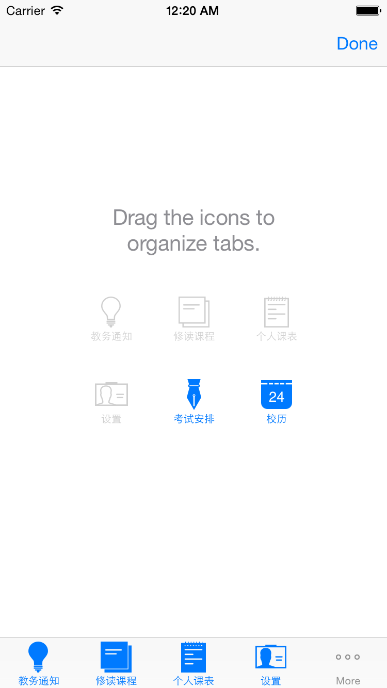
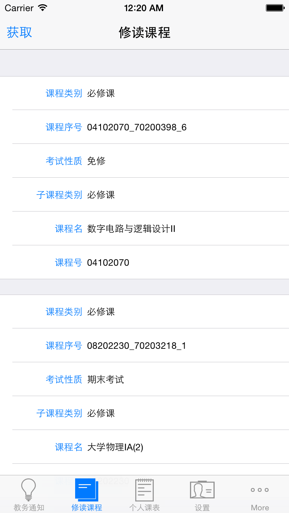
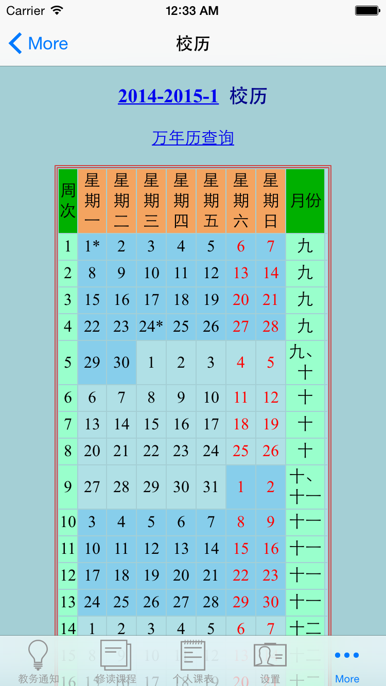
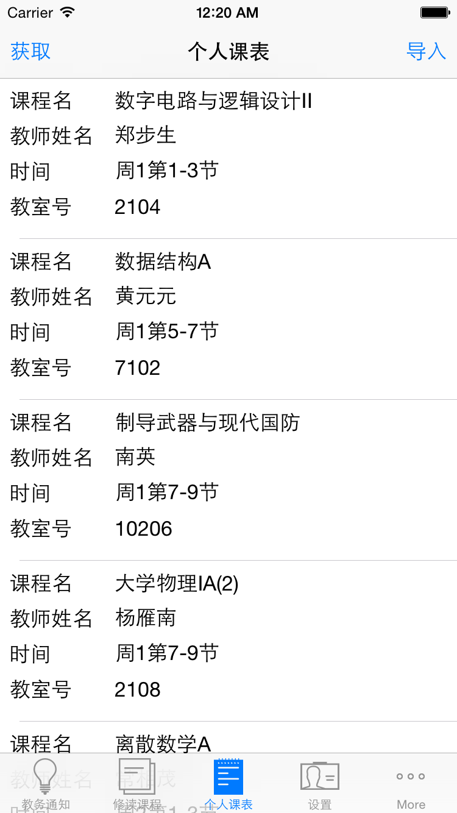
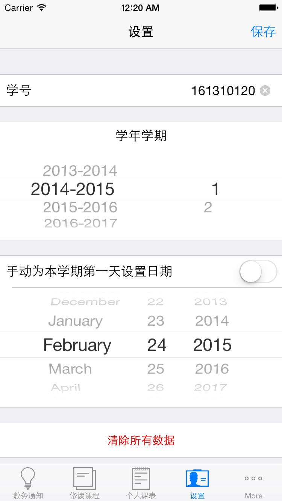
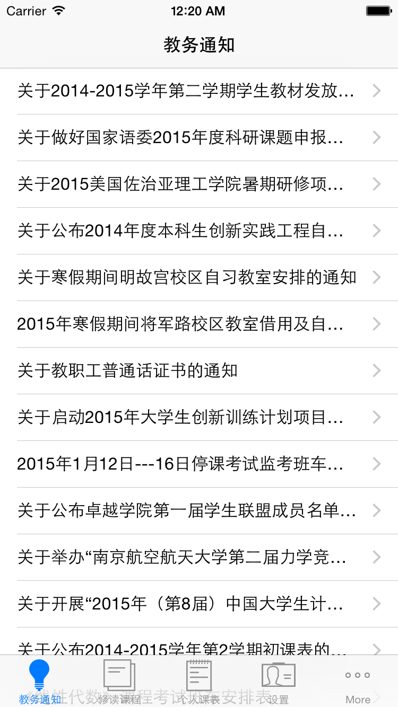
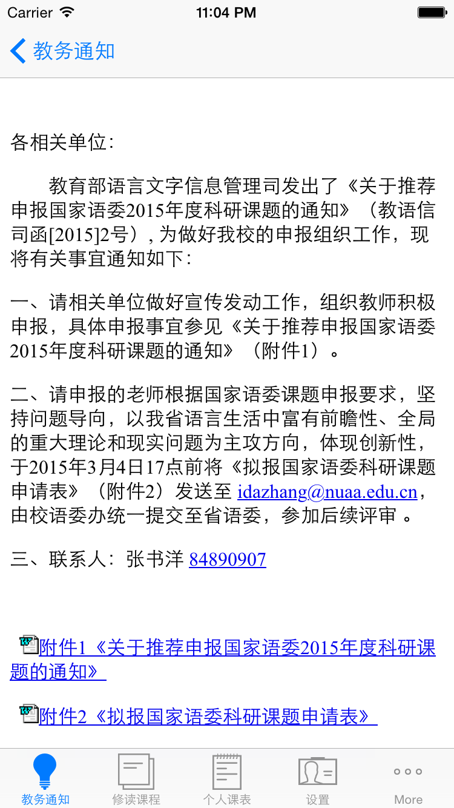
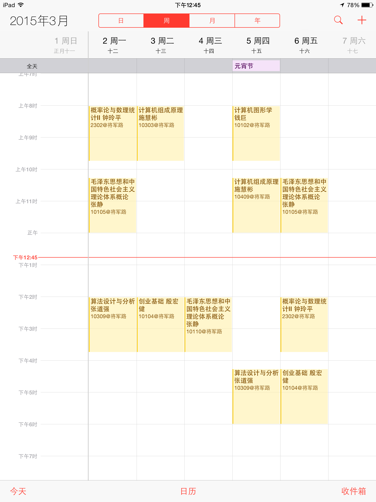

## NUAA+

Import NUAA student timetable on iOS

从教务处获取数据，展示课程名、教师姓名、上课时间和上课教室号等信息，可以在iPhone导入到日历.app，导入时可以选择新建日历或者手动选择导入目标，方便将来删除和更改。

借由iCloud还可同步到OSX，无论是Mac还是iPhone都能随时在通知中心看到当天的课程安排。

其他的功能还有教务通知，查询修读课程（方便申请免修课程的同学及时查询免修申请是否通过），查询考试安排和查询校历。

## Requirements

- Xcode 6.1.1 (6A2008a)
- iOS 7.0 and later

##Developers
- 李建霖：lijianlin1995@gmail.com Wechat:lijianlin1995
- 陈继喆：chenjizhe@outlook.com

##  Open source project Used

- [AEXML](https://github.com/tadija/AEXML)
- [AFNetworking](https://github.com/afnetworking/afnetworking)
- [Async](https://github.com/duemunk/Async)
- [KissXML](https://github.com/robbiehanson/KissXML)
- [snapshot](https://github.com/KrauseFx/snapshot)
- [SOAP-IOS](https://github.com/xujialiang/SOAP-IOS)
- [SketchActive](http://aegeank.com/sketchactive/)
- [SVProgressHUD](https://github.com/TransitApp/SVProgressHUD)

## With Special Thanks to:
- PM Extra 
- c0r3d3v [NUAACalendarImporter](https://github.com/c0r3d3v/NUAACalendarImporter)
- Richard Wei

## Screenshots

||
------------ | ------------- | ------------
||
||

