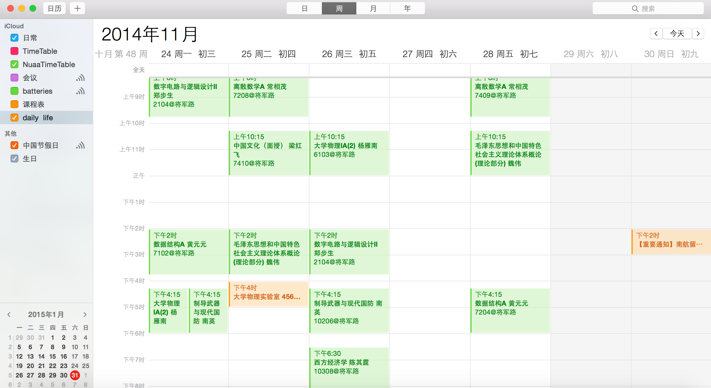

## NUAATimeTable

For students in NUAA import their time table to Calendar.app on iOS device

从教务处获取数据，展示课程名、教师姓名、上课时间和上课教室号等信息，可以在iPhone导入到日历.app，导入时会新建一个EKCalendar不会污染常用的标签，并且方便删除和更改。

借由iCloud还可同步到OSX，无论是Mac还是iPhone都能随时在通知中心看到当天的课程安排。

## Screenshots

## Requirements

- Xcode 6.1.1 (6A2008a)
- iOS 8.0 and later

## Libraries Used

- [AEXML](https://github.com/tadija/AEXML)
- [AFNetworking](https://github.com/afnetworking/afnetworking)
- [SOAP-IOS](https://github.com/xujialiang/SOAP-IOS)
- [KissXML](https://github.com/robbiehanson/KissXML)

